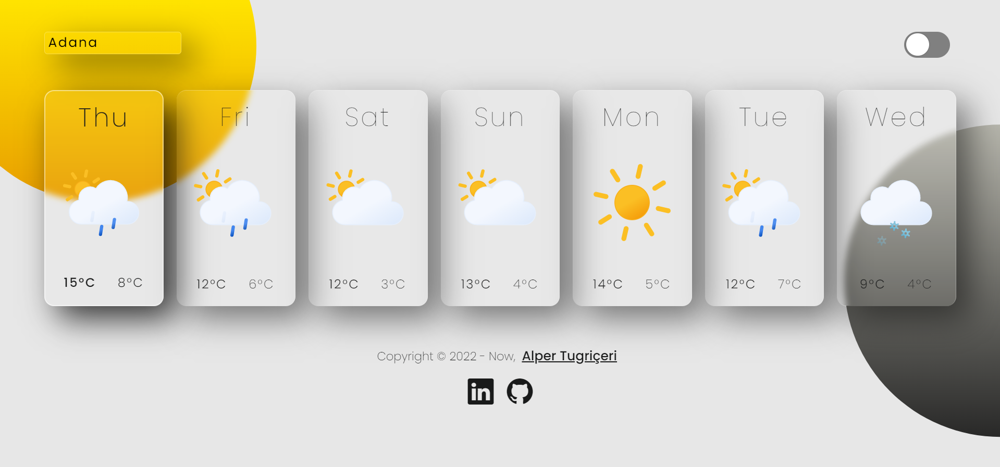
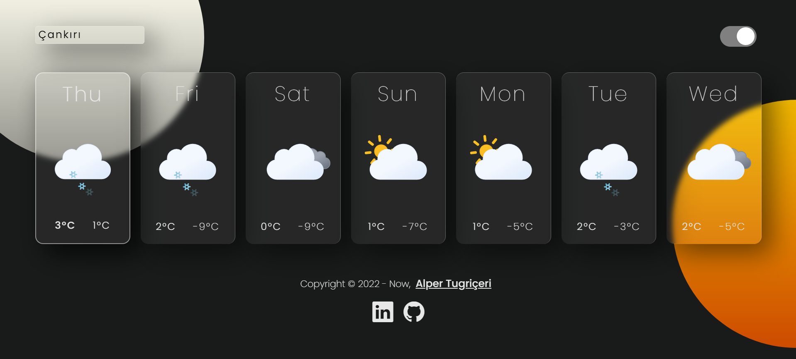

<div id="top"></div>
            
[![MIT License][license-shield]](https://github.com/Atugriceri/weather-react-app/blob/main/LICENSE)
[![LinkedIn][linkedin-shield]](https://www.linkedin.com/in/alpertugriceri/)


<br />
<div align="center">
  <a href="https://github.com/Atugriceri/weather-react-app">
    
  </a>
  <h3 align="center">Weather-React-App</h3>

  <p align="center">
    The project where you can follow the seven-day weather forecast.
    <br />
    <br />
    <a href="https://atugriceri-weather-react-app.netlify.app/">View Demo</a>
  </p>
</div>

<!-- TABLE OF CONTENTS -->
<details>
  <summary>Table of Contents</summary>
  <ol>
    <li>
      <a href="#about-the-project">About The Project</a>
      <ul>
        <li><a href="#built-with">Built With</a></li>
      </ul>
    </li>
    <li>
      <a href="#getting-started">Getting Started</a>
      <ul>
        <li><a href="#prerequisites">Prerequisites</a></li>
        <li><a href="#installation">Installation</a></li>
      </ul>
    </li>
    <li><a href="#usage">Usage</a></li>
    <li><a href="#license">License</a></li>
    <li><a href="#contact">Contact</a></li>
    <li><a href="#acknowledgments">Acknowledgments</a></li>
  </ol>
</details>

<!-- ABOUT THE PROJECT -->
## About The Project



Weather application where you can reach 7-day maximum and minimum temperature values ​​by selecting any city of Turkey, together with icons reflecting the general weather conditions.

The project was developed in conjunction with React.js, including Context, Hooks, and Life Cycles Methods. Styled with Pure CSS and Grid Layout. 

<p align="right">(<a href="#top">back to top</a>)</p>


### Built With

* [React.js](https://reactjs.org/)
* [Axios](https://www.npmjs.com/package/axios)

<p align="right">(<a href="#top">back to top</a>)</p>


<!-- GETTING STARTED -->
## Getting Started

 - Sign up to [www.openweathermap.org](https://openweathermap.org/) with your e-mail and get the API key.
 -  Fork the project and clone it locally.
 -  Create a file at the root of the project called .env with the following contents:

    ```sh
    REACT_APP_API_KEY=YOUR API KEY HERE
    ```
 -  In the project directory, ou can follow the steps below to download the dependencies:
     - Install with npm:
     ```sh
     npm i
     ```
     - Install with yarn:
     ```sh
     yarn
     ```
- In the project directory, you can run:
  - Run with npm:
  ```sh
  npm run
  ```
  - Run with yarn:
  ```sh
  yarn start
  ```

<p align="right">(<a href="#top">back to top</a>)</p>

## Usage

You can select the city and change the site theme as shown below.




[See it live!](https://atugriceri-weather-react-app.netlify.app/)

<p align="right">(<a href="#top">back to top</a>)</p>

## License

Distributed under the MIT License. See `LICENSE.txt` for more information.

<p align="right">(<a href="#top">back to top</a>)</p>


## Contact

Alper Tugriçeri - [Linkedin](https://www.linkedin.com/in/alpertugriceri/) - alpertugriceri@gmail.com

Project Link: [https://github.com/atugriceri/weather-react-app](https://github.com/atugriceri/weather-react-app)

<p align="right">(<a href="#top">back to top</a>)</p>


<!-- ACKNOWLEDGMENTS -->
## Acknowledgments

* [Weather Icons](https://github.com/basmilius/weather-icons)
* [Bootstrap Icons](https://icons.getbootstrap.com/)
* [Cities of JSON](https://gist.github.com/ozdemirburak)

<p align="right">(<a href="#top">back to top</a>)</p>


<!-- MARKDOWN LINKS & IMAGES -->
<!-- https://www.markdownguide.org/basic-syntax/#reference-style-links -->
[license-shield]: https://img.shields.io/github/license/othneildrew/Best-README-Template.svg?style=for-the-badge
[linkedin-shield]: https://img.shields.io/badge/-LinkedIn-black.svg?style=for-the-badge&logo=linkedin&colorB=555